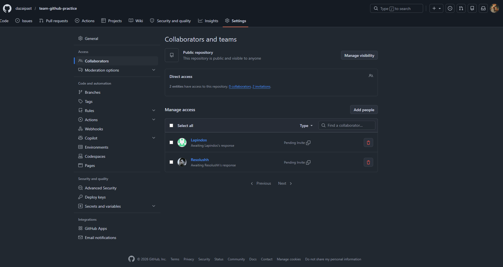

# team-github-practice

### 1. 
Рисунок 1 — Добавление участников в репозиторий

## Используемые инструменты

Git;
GitHub;
VS Code.
## Описание
Это учебный командный проект для практики GitHub.

## Проблема: забыли сделать Pull
Мы увидели, что если участник работает со старой версией проекта, Git может не 
разрешить отправить изменения сразу. Сначала нужно получить актуальную версию 
с GitHub, объединить изменения и только потом отправлять свои

## Статус проекта
Проект находится на этапе тестирования совместной работы.